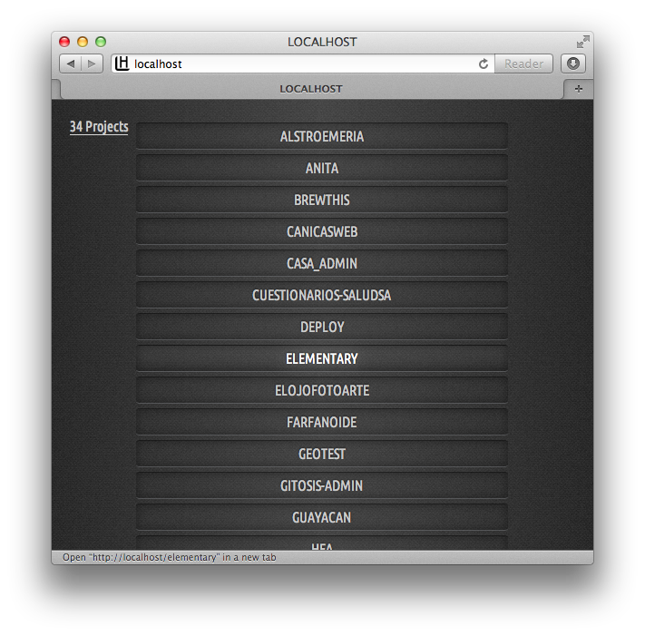

# Local server directory listing

Just a script to "beautify" your local server.

##Installation

To install simply drop index.php to the root of your local server.

You'll also need the [Ubuntu Condensed](http://font.ubuntu.com/) font.

##Disclaimer

I don't recommend using this on your web server as it is vulnerable to attacks.
this is intended for local use only.

Browser support was not a concern while writing this so it'll only work in
modern browsers.
